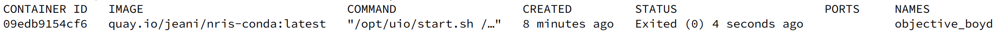

# NRIS conda-base container

**Using containers to manage Conda environments provides better isolation, reproducibility, quota management, centralized maintenance, resource management, performance, and security compared to users installing Conda packages in their home, work or project directories. This makes it a preferred choice for many scientific and data analysis workflows, especially in shared or collaborative environments. It is therefore highly recommended that NRIS users take this image as a basis to add their own Conda packages.**

This is a Dockerfile for a base Ubuntu 22.04 container with MiniConda py39_24.7.1-0 for NRIS Users to install their own Conda packages.

The container comes with:
- `libgl1` (a library that provides interfaces to OpenGL, for rendering graphics);
- `locales` (this provides localization files, for the proper display of language-specific text and settings);
- `micro` (a modern and intuitive terminal-based text editor, for editing files directly from the command line);
- `tzdata` (provides time zone and daylight-saving time data);
- `wget` (a command-line utility, for downloading files from the web);
- `miniconda` (installed in $EBROOTMINICONDA3).

The corresponding container image was automatically built on https://quay.io and can be pulled directly.

It is explained below how to add Conda packages, in this case `octave` version 9.2.0 from Conda-forge (see https://anaconda.org/conda-forge/octave).

For data processing users will take advantage of *bindings* (i.e., `-v` for Docker or `--bind` for Singularity/Apptainer) to make folders from the host (here `./data`) *visible* inside the container (for instance at `/opt/uio/data`).

## With Docker

Pull the image, run it, install the Octave Conda package and check that it works:

```
docker pull quay.io/jeani/nris-conda:latest

docker run -it -v ./data:/opt/uio/data quay.io/jeani/nris-conda:latest

conda install -c conda-forge -y octave==9.2.0

octave-cli
```

Notice that **to be able to reuse the modified container image** it is necessary to *commit* and save to a new image.

For that, identify the *modified* **container-ID** using `docker ps -a` (in the present case `09edb9154cf6`):



then commit the changes by typing `docker commit 09edb9154cf6 octave`, and the next time run: `docker run -it -v ./data:/opt/uio/data octave`.

To be usable on the HPCs **the Docker image has to be converted to a Singularity Image File** (`.sif`) as follows:

```
docker save octave -o octave.tar

Singularity build octave.sif docker-archive://octave.tar
```


## With Singularity/Apptainer

Copy from this repository the Singularity Definition File (`octave.def`) which has in it:

```
Bootstrap : localimage
From: ./nris-conda_latest.sif

%post
     . /opt/uio/start.sh
     conda install -c conda-forge -y octave==9.2.0
     conda clean -afy 
```
From the same directory pull the container image from Quay and build from it another one with Octave, so that can directly be used as is and/or distributed/shared. 

Once inside the container activate the conda environment (`source /opt/uio/start.sh`) and check that Octave works:
```
singularity pull docker://quay.io/jeani/nris-conda:latest

singularity build octave920.sif octave.def

singularity shell --bind ./data:/opt/uio/data octave920.sif

. /opt/uio/start.sh

octave-cli

```
For comparison the Octave version 9.2.0 package installed directly with conda on the host creates **over one hundred thousand files** and takes about **6GB** of disc, whereas the Singularity/Apptainer container image with the very same Octave version 9.2.0 is **a single file** and occupies about **623MB**.


